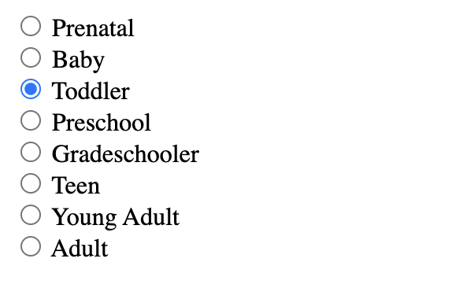
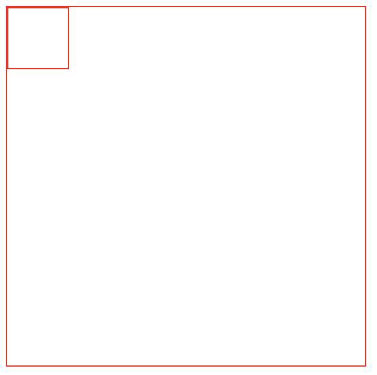
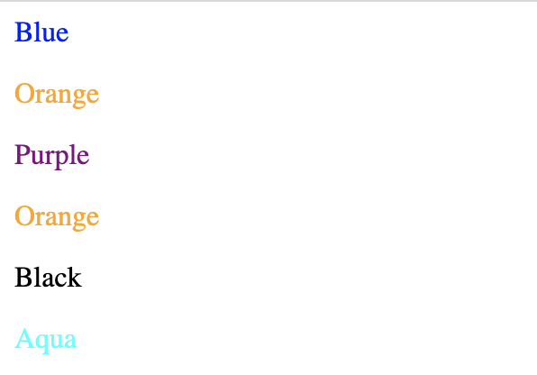
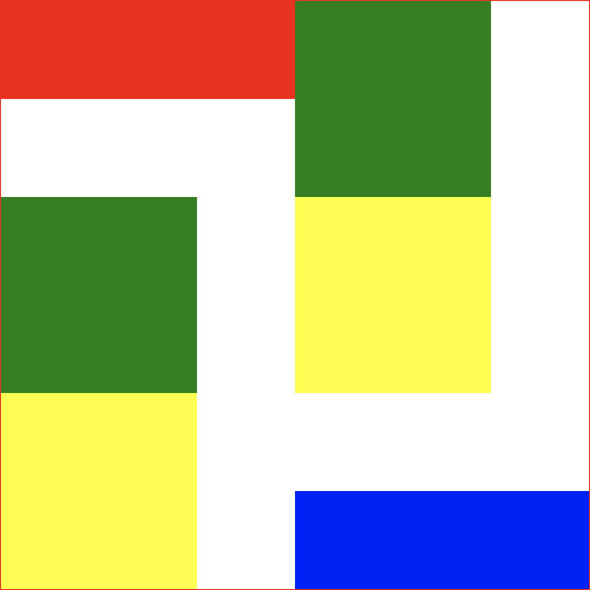

# Entrance exam for mentor

## JSB
### Kiến thức về HTML
1. HTML 2 loại tag chủ yếu là inline & block. Hãy phân loại các tag sau và nêu sự khác biệt của loại tag inline & block.
```html
<div>
<span>
<p>
<ol>
<label>
<input>
<h1>
<b>
<video>
<br>
<hr>

```


---

2. viết code html để liên kết file js & css từ page.html & index.html cấu trúc thư mục sau.
Cây thư mục của các file hiện tại   
```txt
project
├── assets
│   ├── css
│   │   ├── index.css
│   │   └── page.css
│   ├── js
│   │   ├── index.js
│   │   └── page.js
│   └── page.html
└── html
    └── index.html
```


3. Cấu trúc cơ bản của `<table>` gồm những gì? Làm thế nào để tạo một table có đủ các thành phần sử dụng các element liên quan.
---

4. Hãy nêu điểm giống và khác nhau cơ bản giữa ul & ol & dl
---

5. Làm một radio set như hình


---

### Kiến thức về CSS 

1. justify-content và align-items (flexbox) căn chỉnh theo các chiều nào? Giải thích.
---

2. Sử dụng thuộc tính CSS phù hợp khiến một hình ảnh (vuông) trở thành hình tròn.

```html
<div class="rounded">
</div>
```

```css
div{
    width: 500px;
    height: 500px;
    background-color:yellow;
}
```

3. Tạo một button có hình pill như sau

```html
<div class="pill">
</div>
```
```css
div{
    width: 500px;
    height: 500px;
    background-color:yellow;
}
```


4. Viết file css để căn giữa element div trong trường hợp sau



```html
<div class="container border">
    <div class="square border"></div>
</div>
```

```css
.border{
    border:1px solid red;
}
.container{
    width: 300px;
    height: 300px;
}
.square{
    width: 50px;
    height: 50px;
}
```


5. Viết các selector phù hợp để được kết quả như hình 



Viết CSS Selector để cho màu chữ của thẻ p có cùng màu với nội dung bên trong

```html
<div>
    <p>Blue</p>
    <p>Orange</p>
    <span>
        <p>Purple</p>
    </span>
</div>
<p>Orange</p>
<span>
    <p>Black</p>
</span>
<p>Aqua</p>
```


6. Chỉ sử dụng CSS, hãy di chuyển vị trí các ô trở nên sang như hình mẫu với cấu trúc HTML/CSS cho sẵn



```html
<div class="container border">
    <div class="rectangle red"></div>
    <div class="square green"></div>
    <div class="square green"></div>
    <div class="square yellow"></div>
    <div class="square yellow"></div>
    <div class="rectangle blue"></div>
</div>
```

```css
.red{
    background-color: red;
}
.yellow{
    background-color: yellow;
}
.green{
    background-color: green;
}
.blue{
    background-color: blue;
}
.container {
    position: relative;
    left: 0;
    top: 0;
    width: 600px;
    height: 600px;
}
.square{
    width: 200px;
    height: 200px;
}
.rectangle{
    width: 300px;
    height: 100px;
}
```

---

### Kiến thức về Javascript

1. Trả lời kết quả được in ra màn hình ở console của đoạn code sau? Giải thích dòng thứ 4. Làm sao để kiểm tra giá trị một biến có kiểu dữ liệu là Array

```js
let a = {};
let b = "";
let c = 0;
let d = [];
console.log(typeof a)
console.log(typeof b)
console.log(typeof c)
console.log(typeof d)
```

---


2. Kết quả của đoạn code là gì? Giải thích
```js
function f (){
        let b = 9
        return ++b < 10 ? b : 'Yah'
    }
    let a = f()
    console.log(a)
```
---

3. Chỉnh sửa đoạn code sau trở lại cho chính xác. Giải thích 

```js
function bmi_calculator(weight_in_kg, height_in_cm) {
    let bmi = weight_in_kg / height_in_cm /height_in_cm * 10000  ;
    bmi = parseFloat(bmi.toFixed(2))
    let status = ""
    switch (true) {
        case 0 < bmi < 18.5:
            status = "Underweight"
            break
        case 18.5 < bmi < 25:
            status = "Normal"

            break
        case 25 < bmi < 30:
            status = "Overweight"

            break
        case bmi < 30:
            status = "Obese"

            break
        default:
            status = '?'
    }
    return {
        bmi:bmi,
        status:status
    }

}
let result = bmi_calculator(65, 170)
console.log(result)
// {bmi: 22.49, status: "Underweight"}
```
---

4. một element có thể có tối đa bao nhiêu listener cho 1 event cố định. Làm sao xoá listener (unsubscribe) khỏi 1 event? Cho ví dụ cụ thể.


---


5. Viết một regular expression có thể match được email. Ví dụ 

```txt
Letters to the Editor (Your complete mailing address is required):
letters@thehindu.co.in
Readers' Editor:
readerseditor@thehindu.co.in
Advertisements Queries (Print):
inetads@thehindu.co.in
Advertisements Queries (Online):
digital@thehindu.co.in
Advertisements Queries (International):
international@thehindu.co.in
Subscription Queries:
subs@thehindu.co.in
Comments on the website:
web.thehindu@thehindu.co.in
```
```txt
digital@thehindu.co.in;
inetads@thehindu.co.in;
international@thehindu.co.in;
letters@thehindu.co.in;
readerseditor@thehindu.co.in;
subs@thehindu.co.in;
web.thehindu@thehindu.co.in;
```

---


5. Hãy cho biết kết quả đoạn code sau và giải thích.
```js
function resolveAfter2Seconds() {
  console.log("starting slow promise")
  return new Promise(resolve => {
    setTimeout(function() {
      resolve("slow")
      console.log("slow promise is done")
    }, 2000)
  })
}

function resolveAfter1Second() {
  console.log("starting fast promise")
  return new Promise(resolve => {
    setTimeout(function() {
      resolve("fast")
      console.log("fast promise is done")
    }, 1000)
  })
}

async function sequentialStart() {
  console.log('==SEQUENTIAL START==')
  const slow = await resolveAfter2Seconds()
  console.log(slow) 
  const fast = await resolveAfter1Second()
  console.log(fast) 
}

async function concurrentStart() {
  console.log('==CONCURRENT START with await==');
  const slow = resolveAfter2Seconds() 
  const fast = resolveAfter1Second() 
  console.log(await slow) 
  console.log(await fast) 
}

function concurrentPromise() {
  console.log('==CONCURRENT START with Promise.all==')
  return Promise.all([resolveAfter2Seconds(), resolveAfter1Second()]).then((messages) => {
    console.log(messages[0]) 
    console.log(messages[1])
}

async function parallel() {
  console.log('==PARALLEL with await Promise.all==')
  await Promise.all([
      (async()=>console.log(await resolveAfter2Seconds()))(),
      (async()=>console.log(await resolveAfter1Second()))()
  ])
}

sequentialStart()
setTimeout(concurrentStart, 4000)
setTimeout(concurrentPromise, 7000)
setTimeout(parallel, 10000) 
```


---

**Từ câu tiếp theo trở đi sẽ sử dụng chung source code như sau. Đoạn code trên có thể chọn ngẫu nhiên 10 pokemon.**
```js
const domain = 'https://pokeapi.co/api/v2'
const endpoint = 'pokemon'

async function getPokemonNames(pokemonID) {
    const start_time = new Date().valueOf()
    const pokemonName = [];
    for (let i = 0; i < pokemonID.length; i++) {
        pokemonName.push(await getPokemon( `${domain}/${endpoint}/${pokemonID[i]}`))
    }
    return pokemonName
}

function main(){
    const pokemonId = []
    for (let i = 0; i < 10; i++) {
        pokemonId.push(Math.floor(Math.random() * 600))
    }
    console.time('Operation')
    getPokemonNames(pokemonId)
    .then(pokemons => {
        console.log(pokemons)
        console.timeLog("Operation")
    })
}
async function getPokemon(url) {
    // 
}
main()
```

6. Viết hàm `getPokemon` để chương trình chạy đúng, lấy dữ liệu thông endoints bằng `fetch()`, sau đó trả về mảng gồm tên của từng 
Pokemon. Viết bằng 2 cách (async - await & promise).

---

7. Đoạn code ở trên có thời gian thực thi ước tính trên trình duyệt Brave (nhân Chrome) là khoảng 3500ms (Có thể sai số bởi vì tốc độ mạng, server,...). Có cách nào giảm thời gian thực thi xuống không? Nếu có thì hãy trình bày giải pháp và giải thích.

---

8. Cập nhật hàm ở` main` để có thể kết thúc hàm công việc đang chạy (lấy dữ liệu) nếu thời gian chạy quá chậm  (> 2000ms)
Hàm main có thể dùng được viết lại như sau.

---

